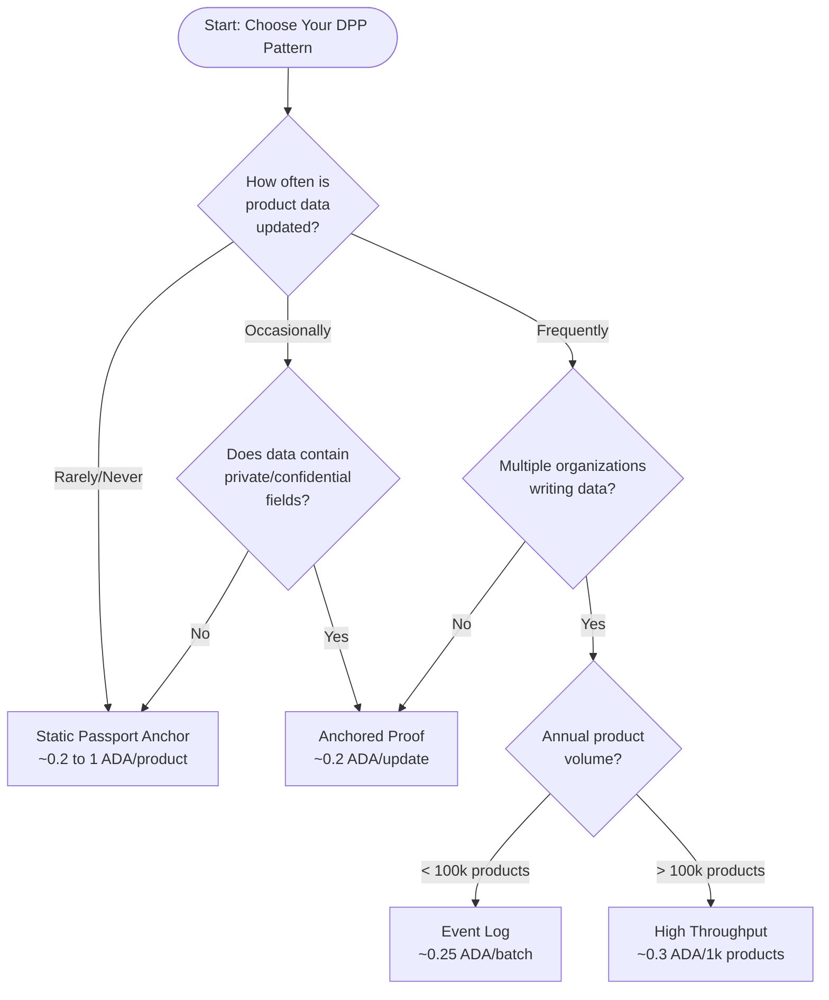
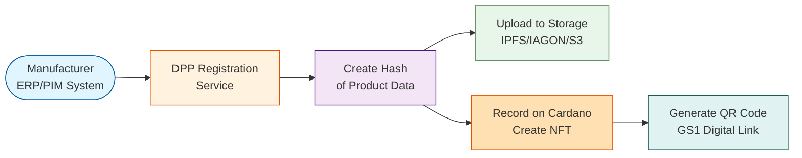
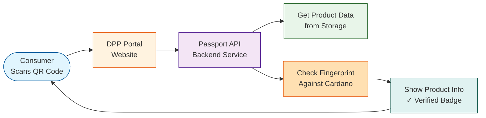
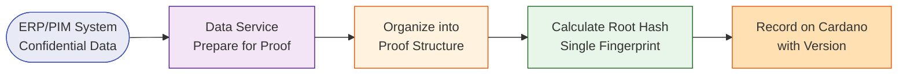
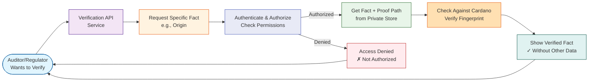
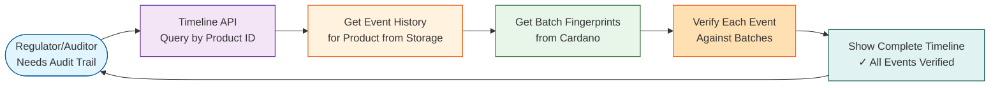
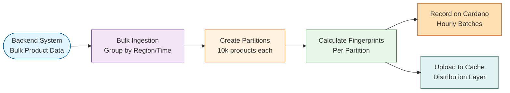
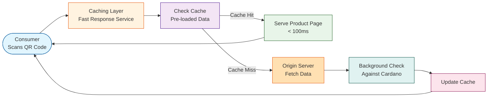

# Digital Product Passport on Cardano — Solution Blueprint v0.1 (Draft)

- **Version:** 0.1 draft
- **Status:** WIP
- **Disclaimer:** Sample data, flows, and code snippets are illustrative only. Final data models, regulatory mappings, and on-chain payload definitions must be validated with DPP subject-matter experts. Contributions and new patterns are welcome.

## Table of Contents

1. [Introduction](#1-introduction)
2. [Persona → Requirement Mapping](#2-persona--requirement-mapping)
   - [Generalized Requirements by Pattern Category](#21-generalized-requirements-by-pattern-category)
   - [Persona Summaries Mapped to Patterns](#22-persona-summaries-mapped-to-patterns)
3. [Decision Matrix](#3-decision-matrix)
4. [Solution Patterns](#4-solution-patterns)
   - [4.1 Static Passport Anchor](#41-static-passport-anchor)
   - [4.2 Anchored Proof (Privacy-preserving proof)](#42-anchored-proof-privacy-preserving-proof)
   - [4.3 Event Log (Append-only lifecycle history)](#43-event-log-append-only-lifecycle-history)
   - [4.4 High Throughput (Fast scanning for millions of products)](#44-high-throughput-fast-scanning-for-millions-of-products)
5. [Trade-off Matrix](#5-trade-off-matrix)
6. [Standards Alignment Guidance](#6-standards-alignment-guidance)
7. [Additional Data Structures (Optional)](#7-additional-data-structures-optional)
8. [Open Points](#8-open-points)
9. [Conclusion](#9-conclusion)
10. [Version History](#10-version-history)


## 1. Introduction

Digital Product Passports (DPP) are a way to carry important product information such as identity, composition, manufacturing details,
usage history, and regulatory compliance throughout the supply chain. They make this information easy to share and understand 
across different systems and partners. Under the new EU Ecodesign regulation, DPPs will become a required feature in many industries 
to support transparency, sustainability, and compliance.

**Why Cardano for DPP?**

Cardano offers:
- **Predictable fees** - Low, stable transaction costs
- **Deterministic execution** - UTxO model provides reliable smart contract behavior
- **Mature standards** - Built-in NFT and metadata standards (CIP-25, CIP-68)
- **Tamperproof anchors** - Immutable records while keeping sensitive data off-chain

**Purpose of this blueprint:**

This draft blueprint offers a library of Cardano-centric solution patterns that can be mixed and matched. Rather than prescribing
one architecture or data model, it highlights options that teams can choose from once they know their regulatory scope, partners, and governance setup.


## 2. Persona → Requirement Mapping

### 2.1 Generalized requirements by pattern category

| Pattern category | Generalized requirements | Personas supporting this need |
|-----------------|--------------------------|-------------------------------|
| **Static Passport Anchor** | Low-complexity setup, one-time or rare updates, QR/NFC access, predictable ADA spend, guidance on mandatory vs optional fields | Clara (Compliance SME), early textile adopters |
| **Anchored Proof** | Keep ERP/PIM data private, publish tamperproof attestations, selective disclosure for regulators, connector toolkits | Javier (Integration provider), Clara (for gradual upgrades) |
| **Event Log** | Append-only lifecycle history, multi-party submissions, IoT feeds, authenticated update governance, regulator-friendly audit trail | Sophie (Lifecycle tracker), Marina (Plastic recovery) |
| **High Throughput** | Scale to millions of SKUs, sub-second QR scans, batch operations, global infrastructure resilience, SLA monitoring | Marco (Enterprise retailer), Sophie (large battery fleets) |

### 2.2 Persona summaries mapped to patterns

| Persona | Goals & key needs | Pain points | Suggested starting pattern |
|---------|------------------|-------------|---------------------------|
| **Clara Müller** — Compliance-first SME manufacturer | Publish required ESPR fields cheaply, update when suppliers change, keep data accessible via GS1 Digital Link | Limited IT capacity, evolving requirements, per-SKU overhead | Static Passport Anchor → Anchored Proof when versioning starts |
| **Sophie Laurent** — Lifecycle event tracker (automotive batteries) | Consolidate multi-party events, integrate IoT, maintain full history for audits | Partner onboarding friction, synchronizing events, certification gaps | Event Log with Anchored Proof for certificate snapshots |
| **Marco Rossi** — High-throughput retailer CTO | Issue passports at scale, deliver instant consumer responses, process bulk updates | Performance at scale, consumer trust, cost control | High Throughput (batched anchors + caching layer) |
| **Marina Silva** — Plastic recovery operations | Verify recovery activities, prevent double counting, produce proof for ESG claims | Distributed collectors, data accuracy, trust across network | Event Log with certificate issuance/burn anchored on-chain |
| **Dr. Javier Ortega** — Integration provider | Bridge ERP to blockchain, maintain confidentiality, deliver dashboards | Balancing privacy vs transparency, staying current on standards | Anchored Proof toolkit + event log API adapters |


## 3. Decision Matrix

Use this flowchart to choose the right pattern based on your requirements:




## 4. Solution Patterns

All diagrams follow a simplified component style. Components can be deployed as managed services or integrated into existing systems.

**Important:** On-chain payloads can be encoded as JSON or CBOR; final data formats require agreement with domain leads.

### 4.1 Static Passport Anchor

**Where it fits:** Initial compliance for SMEs with stable product data.

**On-chain vs off-chain mix:**
- **On-chain:** Single transaction storing minimal metadata (policy ID, GTIN, content hash) via CIP-25 or CIP-68
- **Off-chain:** Full passport file (JSON-LD, XML, etc.) stored in content-addressed storage (IPFS, IAGON, S3). QR/NFC resolves to a GS1 Digital Link landing page


#### A. Registering Product Data

This is how manufacturers create and register product passports.

**Flow diagram:**



**Steps to register a product:**

1. **Export product information** - Manufacturer exports product details from their system (materials, origin, care instructions, etc.)
2. **Create data fingerprint** - Service organizes the data in standard format and creates a unique fingerprint (hash)
3. **Store full details** - Upload complete product passport to storage (IPFS, IAGON, or cloud storage)
4. **Record on blockchain** - Create a Cardano NFT containing the product ID, hash, and link to stored data
5. **Generate QR code** - Create a scannable QR code using GS1 Digital Link format

**Sample data stored on Cardano (illustrative only):**

```json
{
  "<DPP_label>": {
    "<policy_id>": {
      "GTIN-09506000123457": {
        "name": "Eco Tee Sample",
        "files": [{
          "name": "passport.json",
          "src": "ipfs://bafy..."
        }],
        "hashes": {
          "blake2b": "0xabc123"
        },
        "issued_at": "2025-10-01"
      }
    }
  }
}
```

> **Note:** A new DPP metadata label (an integer) should be defined for Digital Product Passports. The 721 label (CIP-25 NFT metadata) should not be used to avoid confusion with NFT standards. On-chain data can use CBOR encoding for efficiency. Final field names will follow DPP standards.

**Skeleton code (JavaScript example):**

```javascript
// registerProduct.js (example only - not production ready)
function registerProduct(product) {
  // 1. TODO: Organize product data in standard format
  const bytes = Buffer.from(JSON.stringify(product));
  const hash = blake2b(bytes); // Create fingerprint

  // 2. TODO: Build Cardano metadata structure
  const metadata = buildMetadata(product.gtin, hash, product.storageLink);

  // 3. TODO: Create and submit Cardano transaction
  submitTx({ metadata, signer: issuerKey });

  // 4. TODO: Save transaction details for records
  return {
    gtin: product.gtin,
    anchorHash: metadata.hash,
    txHash: "<pending>"
  };
}
```

**Skeleton validator (Aiken example):**

```aiken
validator static_passport_anchor(owner: VerificationKeyHash) {
  fn check(_datum: Data, _redeemer: Data, ctx: ScriptContext) -> Bool {
    let signed = ctx.transaction.signatories.contains(owner)
    signed // TODO: Add checks for single-use minting
  }
}
```

#### B. Checking Product Information

This is how consumers and regulators verify product passports.

**Flow diagram:**



**Steps to verify a product:**

1. **Scan QR code** - Consumer scans the QR code on the product using their phone
2. **Open portal** - QR code opens the DPP portal website
3. **Fetch product data** - Portal retrieves the full product information from storage
4. **Verify fingerprint** - Portal checks that the data fingerprint matches what's recorded on Cardano
5. **Display results** - Show product information with a "✓ Verified on Cardano" badge if fingerprints match


#### C. Handling Data Updates (Versioning)

Even though the Static Passport Anchor pattern is designed for rarely or never updated scenarios, DPP data may still need to change over time due to regulatory updates, supplier changes, or corrections. When updates are required, versioning can be implemented using Cardano native assets.

**Two Versioning Approaches:**

**Approach 1: Burn and Mint**

In this approach, the existing DPP native asset is burned and a new asset is minted with the next version number and updated data.

**Benefits:**
- Unlocks ADA that was locked in the UTxO containing the burned token
- Provides a clean version transition with only the current version active
- With CIP-68 tokens, additional validation rules and checks can be enforced during burn/mint operations to ensure proper version progression

**Considerations:**
- Requires transaction to burn old asset and mint new one
- Must maintain proper version sequencing in validator logic

**Approach 2: Mint Only (No Burn)**

In this approach, a new DPP native asset is minted with the next version number without burning previous versions.

**Benefits:**
- Preserves complete version history on-chain
- Simpler transaction flow (only minting required)
- Allows querying historical versions if needed

**Considerations:**
- DPP native assets for multiple versions co-exist on-chain
- Minimum ADA remains locked in UTxOs holding these DPP native assets or tokens
- Requires clear mechanism to identify the "current" version (e.g., highest version number)
- May accumulate locked ADA over many version updates

> **Note:** These versioning approaches are not limited to Static Passport Anchor. They apply to any pattern in this blueprint where DPP native assets need versioning. Teams using Anchored Proof, Event Log, or High Throughput patterns should evaluate the same burn-and-mint vs. mint-only trade-offs based on their specific update frequency and ADA liquidity requirements.

---

### 4.2 Anchored Proof (Privacy-preserving proof)

**Where it fits:** Confidential product data stays in ERP; verifiers rely on on-chain hashes.

**On-chain vs off-chain mix:**
- **On-chain:** Store fingerprint (Merkle root), issuer identifier (DID or key hash), and version metadata (CIP-68 reference tokens recommended for updates); optionally include the GTIN (plain or hashed) when a public product identifier is needed
- **Off-chain:** Full product data with manufacturer signature; individual proofs delivered per-claim when needed


#### A. Creating Privacy-Preserving Proof

This is how manufacturers create verifiable data while keeping sensitive information private.

**Flow diagram:**



**Steps to create proof:**

1. **Export product data** - ERP system exports all product information (some fields marked as confidential)
2. **Prepare for proof** - Service organizes data and signs it with manufacturer's digital signature
3. **Build proof structure** - Arrange individual facts (material=cotton, origin=India, cost=PRIVATE) into a tree structure (Merkle tree)
4. **Calculate fingerprint** - Compute single hash that represents all the data together
5. **Anchor on blockchain** - Store only the fingerprint on Cardano, along with version number

**How the proof structure (Merkle Tree) works:**

Think of it like organizing facts into folders:
- Each fact gets its own fingerprint (hash)
- Combine pairs of fingerprints to create parent fingerprints
- Continue until you have one single fingerprint at the top (root hash)
- This structure lets you prove individual facts without revealing everything

**Sample data recorded on Cardano (illustrative only):**

```json
{
  "root": "0x5bd2...",
  "gtin": "09506000123457",
  "version": 4,
  "timestamp": 1730409600,
  "issuer": "did:example:manufacturer123"
}
```

> **Note:** On-chain data can use CBOR encoding for efficiency. The GTIN field is optional; store a hashed GTIN instead if public disclosure is sensitive. Exact structure will follow DPP standards.
> The issuer identifier can be a DID or a verification key hash, depending on your trust registry.

**Skeleton code (JavaScript example):**

```javascript
// createProof.js (example only - not production ready)
function createPrivacyProof(productData) {
  // 1. TODO: Organize product facts into tree structure
  const merkleRoot = buildMerkleRoot(productData.claims);

  // 2. TODO: Prepare data for blockchain
  const datum = {
    root: merkleRoot,
    gtin: productData.gtin, // optional: include when public identifier required
    version: productData.version,
    timestamp: Date.now()
  };

  // 3. TODO: Submit transaction to Cardano
  submitRefTokenScriptTx({ datum, signer: issuerKey });

  return { root: merkleRoot, version: productData.version };
}
```

**Skeleton validator (Aiken example):**

```aiken
validator anchored_proof(owner: VerificationKeyHash) {
  fn update(prev: {version: Int}, next: {version: Int}, ctx: ScriptContext) -> Bool {
    let signer_ok = ctx.transaction.signatories.contains(owner)
    let version_ok = next.version == prev.version + 1
    signer_ok && version_ok // TODO: Add root format and timestamp checks
  }
}
```


#### B. Verifying Specific Facts

This is how auditors verify specific claims without seeing all confidential data.

**Flow diagram:**



**Steps to verify a specific fact:**

1. **Request specific information** - Auditor asks "What is this product's origin?" (not asking for everything)
2. **Authenticate and authorize** - API verifies requester's identity and checks if they have permission to access the requested claim
3. **Fetch fact with proof** - If authorized, API provides the answer ("India") plus a proof path through the tree structure
4. **Get blockchain record** - API retrieves the root fingerprint from Cardano
5. **Verify the proof** - Calculate: Does "origin=India" + proof path = root fingerprint on blockchain?
6. **Show result** - If match: "✓ Origin verified as India" - without revealing supplier pricing or other confidential data

**Example selective disclosure:**

**Auditor asks:** "Is the origin India?"

**System provides:**
- Fact: "origin = India"
- Proof: [proof_piece_1, proof_piece_2, proof_piece_3]
- Root fingerprint from Cardano: "0x5bd2..."

**Verification:**
- Combine fact + proof pieces = calculated fingerprint
- Compare with blockchain: calculated = 0x5bd2... ✓
- Result: Origin verified WITHOUT revealing supplier cost or other private data


**Access Control and Authorization**

Since the Anchored Proof pattern is privacy-preserving, it requires an access control layer to ensure only authorized requesters can view specific claims. Product data should be disclosed only when required and only to requesters with proper permissions.

**Claim Categorization (Example):**

Product claims can be organized into categories based on sensitivity and intended audience:
- **Public** - Sustainability information, care instructions (accessible to consumers)
- **Regulatory** - Origin, compliance certificates, audit trails (accessible to regulators/auditors)
- **Confidential** - Supplier pricing, trade secrets, internal cost structures (restricted to authorized parties)

**Authorization Approaches:**

Implementers should evaluate the following approaches based on their specific requirements:

- **Role-Based Access Control (RBAC)** - Assign roles to requesters (e.g., consumer, auditor, regulator) and map roles to accessible claim categories through an access control list
- **Token-Based Authorization** - Issue signed tokens (JWT-like) to authorized parties with embedded scope defining which claim categories they can access
- **Attribute-Based Access** - Use cryptographic credentials where different claims are protected by different keys, requiring requesters to present proper decryption credentials
- **Authorization Token (NFT-based)** - Issue NFTs as authorization credentials where token metadata defines access scope; requesters prove NFT ownership when accessing claims; NFTs can be revoked by burning or time-limited

> **Note:** The choice of access control mechanism should consider regulatory compliance requirements (e.g., GDPR, data minimization principles), existing infrastructure, and the level of decentralization desired. Implementers may also combine multiple approaches for a layered security model.

---

### 4.3 Event Log (Append-only lifecycle history)

**Where it fits:** Coordinating many stakeholders contributing lifecycle events or recovery certificates.

**On-chain vs off-chain mix:**
- **On-chain:** Append-only record storing batch fingerprints (Merkle roots) with checkpoint numbers
- **Off-chain:** Event collector gathers events from multiple parties, batches them periodically, keeps full event details in secure storage


#### A. Recording Lifecycle Events

This is how different partners (manufacturers, shippers, recyclers) record events throughout a product's life.

**Flow diagram:**



```mermaid
flowchart LR
    Partner([Supply Chain Partner<br/>Manufacturer/Shipper/Recycler]) --> Submit[Submit Event<br/>with Digital Signature]
    Submit --> Queue[Event Queue<br/>Validate & Store]
    Queue --> Batch[Collect Events<br/>Create Batch]
    Batch --> Hash[Calculate Batch Hash<br/>Merkle Tree]
    Hash --> Cardano[Record on Cardano<br/>Append-Only]

    style Partner fill:#E1F5FE,stroke:#01579B
    style Submit fill:#F3E5F5,stroke:#4A148C
    style Queue fill:#FFF3E0,stroke:#E65100
    style Batch fill:#E8F5E9,stroke:#1B5E20
    style Hash fill:#FFE0B2,stroke:#E65100
    style Cardano fill:#E0F2F1,stroke:#004D40
```

**Steps to record events:**

1. **Partner submits event** - Supply chain partner records an event (e.g., "Battery shipped from factory to distributor on Oct 1")
2. **Verify identity** - System checks the partner's digital signature to confirm they're authorized
3. **Store event** - Save full event details with timestamp in secure storage
4. **Collect into batch** - Gather events over a time period (e.g., hourly) or until reaching batch size (e.g., 100 events)
5. **Calculate batch fingerprint** - Create Merkle tree of all events and compute root hash
6. **Record on blockchain** - Submit batch fingerprint to Cardano with batch number (prevents anyone from going back and changing history)

**Sample batch recorded on Cardano (illustrative only):**

```json
{
  "batch_id": "evt-2025-10-01T08",
  "root": "0x91af...",
  "index": 27,
  "events": 142,
  "period": "2025-10-01T08:00Z/2025-10-01T08:59Z"
}
```

> **Note:** On-chain data can use CBOR encoding to reduce costs.

**Skeleton code (JavaScript example):**

```javascript
// recordEventBatch.js (example only - not production ready)
function recordEventBatch(batch) {
  // 1. TODO: Build tree from all events in batch
  const root = buildMerkleRoot(batch.events);

  // 2. TODO: Prepare batch info for blockchain
  const datum = {
    root,
    index: batch.index,
    period: batch.period
  };

  // 3. TODO: Submit to Cardano (append-only, can't modify past batches)
  submitEventLogTx({ datum, signer: platformKey });

  return { index: batch.index, txHash: "<pending>" };
}
```

**Skeleton validator (Aiken example):**

```aiken
validator event_log(owner: VerificationKeyHash) {
  fn append(prev: {index: Int}, next: {index: Int}, ctx: ScriptContext) -> Bool {
    let signer_ok = ctx.transaction.signatories.contains(owner)
    let monotonic = next.index == prev.index + 1
    signer_ok && monotonic // TODO: Add hash and period checks
  }
}
```


#### B. Viewing Event History

This is how regulators and auditors view the complete history of events for a product.

**Flow diagram:**



**Steps to view event history:**

1. **Request timeline** - Auditor asks for complete history of a specific product
2. **Fetch events** - API retrieves all events for that product from secure storage
3. **Get blockchain records** - Fetch all batch fingerprints from Cardano
4. **Verify events** - For each event, check that it's included in a recorded batch (using Merkle proof)
5. **Show timeline** - Display chronological history with verification status:
   - Oct 1: ✓ Manufactured (verified in batch #25)
   - Oct 5: ✓ Shipped (verified in batch #26)
   - Oct 10: ✓ Sold (verified in batch #27)
   - etc.

**Example timeline display:**

```
Product Battery-ABC-123 Lifecycle:

✓ Sep 15, 2025 - Manufactured
  Factory: DE-7, Germany
  Capacity: 75kWh
  Verified in batch #25

✓ Sep 20, 2025 - Shipped
  From: Factory DE-7
  To: Distribution FR-2
  Carrier: DHL
  Verified in batch #26

✓ Oct 1, 2025 - Installed in Vehicle
  Dealer: EV Dealer Paris
  Vehicle VIN: WVWZZZ1JZ3W386752
  Verified in batch #27

All events verified on Cardano blockchain ✓
```

---

### 4.4 High Throughput (Fast scanning for millions of products)

**Where it fits:** Enterprises serving millions of passports with strict latency SLAs.

**On-chain vs off-chain mix:**
- **On-chain:** Periodic batch anchors (hourly/daily) storing fingerprints for thousands of products at once
- **Off-chain:** Pre-loaded passport pages stored in distributed caching infrastructure for instant access, background verification against blockchain


#### A. Processing Bulk Products

This is how large retailers handle millions of products efficiently with minimal blockchain cost.

**Flow diagram:**



**Steps to process bulk products:**

1. **Bulk data import** - Backend receives product updates in bulk (could be millions per day)
2. **Group into partitions** - Organize products by region, brand, or time window (e.g., "textiles-europe-morning")
3. **Create partition fingerprint** - Build Merkle tree for each partition (e.g., 10,000 products), calculate root hash
4. **Record on blockchain** - Submit one transaction per partition to Cardano (instead of millions of transactions)
5. **Distribute to cache** - Upload product data and proofs to distributed caching infrastructure
6. **Pre-compute responses** - Generate ready-to-serve product pages with proofs included

**Cost efficiency example:**
- Traditional: 1 million products × 0.2 ADA = 200,000 ADA
- High Throughput: 1 million products / 10,000 per batch x 0.3 ADA = 30 ADA

**Sample partition recorded on Cardano (illustrative only):**

```json
{
  "partition": "textiles-emea-2025-10-01T00",
  "root": "0xd4f6...",
  "window": "2025-10-01T00:00Z/2025-10-01T00:29Z",
  "batch_size": 5000
}
```

> **Note:** On-chain data can use CBOR encoding.

**Skeleton code (JavaScript example):**

```javascript
// processBulkProducts.js (example only - not production ready)
function processBulkProducts(partition) {
  // 1. TODO: Build Merkle tree for partition
  const root = buildMerkleRoot(partition.items);

  // 2. TODO: Prepare partition metadata
  const metadata = {
    partition: partition.id,
    window: partition.window,
    root
  };

  // 3. TODO: Submit single transaction for entire partition
  submitBatchTx({ metadata, signer: opsKey });

  // 4. TODO: Upload proof bundles to caching infrastructure
  uploadProofBundle(partition.items, root);
}
```

**Skeleton validator (Aiken example):**

```aiken
validator high_throughput(owner: VerificationKeyHash) {
  fn update(prev: {window: ByteArray}, next: {window: ByteArray}, ctx: ScriptContext) -> Bool {
    let signer_ok = ctx.transaction.signatories.contains(owner)
    // TODO: Add window ordering and partition ID checks
    signer_ok
  }
}
```


#### B. Fast Consumer Scanning

This is how consumers get instant responses (< 300ms) when scanning QR codes.

**Flow diagram:**



**Steps for instant scanning:**

1. **Consumer scans QR** - QR code directs to the fast response service
2. **Check cache** - System checks if product data is already pre-loaded in cache
3. **Instant response** - If cached: serve immediately (typically 50-150ms)
4. **Background verification** - System periodically verifies cached data against Cardano (not during scan - happens in background)
5. **Display product info** - Show complete product passport with "✓ Verified" badge

**Performance optimization:**

- **Pre-loading:** Most popular products pre-loaded in cache
- **Geographic distribution:** Deploy caching infrastructure close to consumers (e.g., CDN edge networks, regional servers, distributed cache clusters)
- **Compression:** Data compressed for faster transfer
- **Smart caching:** Frequently scanned products stay in cache longer

**Consumer experience:**

```
[Consumer scans QR code]
  ↓
[Page loads in 87ms]
  ↓
Product: Eco Cotton T-Shirt
Brand: Sustainable Fashion Co
Origin: Organic cotton from India (95%)
Care: Machine wash cold
✓ Verified on Cardano (batch #1523)
Last verified: 2 minutes ago
```

**Why it's fast:**

- Product data cached close to consumers (reducing network latency)
- Blockchain verification happens in background, not during scan
- Pre-computed proofs (no calculation needed at scan time)
- Smart caching keeps popular products instantly available


## 5. Trade-off Matrix

This table compares the four patterns across key dimensions to help you choose:

| Pattern | Complexity | Typical on-chain cost (ADA)         | Throughput capacity | Transparency | Privacy posture |
|---------|------------|-------------------------------------|--------------------|--------------| ----------------|
| **Static Passport Anchor** | Low | ≈ 0.2 to 1 ADA per product or batch | Low (occasional writes) | High (static public anchor) | Moderate (keep sensitive data off-chain) |
| **Anchored Proof** | Medium | ≈ 0.2 ADA per update                | Medium (versioned updates) | High (proof visible, data hidden) | High (only hashes on-chain) |
| **Event Log** | Medium-High | ≈ 0.25 ADA per batch                | Medium-High (depends on batch window) | High (append-only trail) | High (detailed data stays off-chain) |
| **High Throughput** | High | ≈ 0.3 ADA per 1k items anchored     | Very High (cached responses) | High (batch anchors auditable) | High (selective disclosure via proofs) |

**Notes:**
- Costs are indicative; actual fees depend on transaction size and Cardano parameter updates
- All patterns maintain high transparency through on-chain anchors
- Privacy is achieved by keeping detailed data off-chain with cryptographic proofs


## 6. Standards Alignment Guidance

### Mandatory for immediate compliance

Standards you should adopt right away to ensure regulatory compliance:

- **GS1 Digital Link** - For QR/NFC resolvers using format: `https://id.gs1.org/01/{gtin}`
- **CIP-25 or CIP-68** - Cardano-native standards for metadata and updatable reference tokens
- **Merkle tree anchoring** - Simple, explainable proofs that regulators can understand

### Optional / adopt when ready

Standards to consider as your implementation matures:

- **JSON-LD Verifiable Credentials** - For interoperable off-chain claims and selective disclosure
- **GS1 EPCIS 2.0** - For lifecycle event semantics and supply chain interoperability
- **Hydra Head** - Layer 2 solution for intra-consortium high-frequency updates


## 7. Additional Data Structures (Optional)

### Overview

**Merkle Tree is the recommended default** for all patterns described in this blueprint. It's simple, well-tested, and works for most use cases.

This section describes **optional alternative structures** that teams may explore if they have specific requirements. These are not necessary for basic implementation but may be useful for certain advanced scenarios.

**Important:** All structures remain off-chain - only the resulting root hash (or checkpoint) needs anchoring on Cardano.


### Merkle Tree (Default/Recommended)

**What it is:** A tree structure where data is organized in pairs, hashed together level by level until reaching a single root hash.

**Why consider it:**
- Simple to understand and implement
- Well-tested with libraries available for most languages
- Predictable proof sizes
- Good for static batches or periodic updates

**Watch-outs:**
- Need to rebuild tree when data changes
- Not optimal for frequent individual item updates

**Best for:** Static Passport Anchor, Anchored Proof (batch updates), High Throughput


### Merkle Patricia Trie (MPT)

**What it is:** A tree that compresses paths when possible, optimized for key-value storage with variable-length keys.

**Why consider it:**
- Good for key-value lookups where paths share prefixes
- Efficient single-key updates without rebuilding entire tree
- Proven in Ethereum tooling

**Watch-outs:**
- More complex encoding (nibbles, node types)
- Heavier to implement for teams new to tries
- Larger proof sizes than Binary Merkle Tree in many cases

**Cardano Implementation:**

For teams wanting to use MPT on Cardano, the Aiken ecosystem provides:

**Merkle Patricia Forestry library:**
- Repository: https://github.com/aiken-lang/merkle-patricia-forestry
- Provides on-chain verification of MPT proofs
- Enables authenticated key-value lookups with proofs submitted in redeemers
- Suitable for per-product state with frequent single-key updates

**Usage pattern:**
- Off-chain: Maintain MPT over canonicalized (key, value) pairs
- On update: Compute new root and submit anchor update transaction
- On-chain: Store current trie root in datum; verify proofs in validator

**Best for:** Products requiring frequent per-item updates with path-based proofs


### Merkle Mountain Range (MMR)

**What it is:** A structure optimized for append-only data, maintaining multiple "peaks" that combine efficiently.

**Why consider it:**
- Natural fit for append-only event logs
- Supports historical proofs without rehashing everything
- Efficient for time-ordered events

**Watch-outs:**
- Not ideal when you need to edit or remove events
- Proof verification slightly more involved
- Less common libraries available

**Best for:** Event Log pattern, audit trails, immutable history tracking


### Jellyfish Merkle Tree

**What it is:** An advanced structure providing balanced updates even with many insertions/deletions. Particularly useful for version-based keys where you need to track different versions of the same data.

**Why consider it:**
- Balanced updates across operations
- Compact proofs
- Good for dynamic datasets
- Excellent for version-based key storage (e.g., product_id:version_1, product_id:version_2)
- Maintains performance even with frequent updates to versioned data

**Watch-outs:**
- Less common libraries for Cardano stacks
- Higher implementation complexity
- Overkill for simple use cases

**Best for:** Advanced use cases with high update frequency, strict proof size requirements, and version-based key management


### Simple Hash Chaining with Checkpoints

**What it is:** Each event includes the hash of the previous event, forming a chain. Periodically anchor a Merkle root of the chain.

**Why consider it:**
- Extremely simple append-only log
- Minimal implementation overhead
- Easy to understand and audit

**Watch-outs:**
- Proof size grows with chain length without checkpoints
- Must checkpoint regularly to bound verification cost
- Linear verification time for long chains

**Best for:** Simple event sequences with regular checkpointing (< 100 events per checkpoint)


### Recommendation Summary

| Pattern | Recommended Structure | Reason |
|---------|----------------------|--------|
| Static Passport Anchor | Merkle Tree | Simple, one-time or rare updates |
| Anchored Proof | Merkle Tree | Batch updates, proven approach |
| Event Log | MMR or Hash Chain + Checkpoints | Append-only, historical proofs |
| High Throughput | Merkle Tree | Balance simplicity and efficiency |

**Note:** Select the structure that matches your update pattern and verification needs. Start simple (Merkle Tree) and evolve to more specialized structures only if your use case demands it.


## 8. Open Points

- Need a plan so cached responses only show as verified after the blockchain check finishes (High Throughput).
- Need a clear way to publish and trust partner signing keys for event submissions (Event Log).
- Need a passport status update process to mark records inactive or replaced (Static Passport Anchor, Anchored Proof, Event Log).
- Need shared rules for hashing/serializing data so every team calculates the same fingerprints (All patterns).


## 9. Conclusion

### Summary

This draft blueprint outlines several Cardano-first solution patterns that different teams can adopt or extend. It intentionally avoids deep DPP policy details because final data obligations are still being consolidated with domain experts.

### Key Principles

**Modular approach:**
- Treat these patterns as building blocks
- Pick the one that matches today's requirement
- Evolve toward richer solutions as needs grow

**Flexibility:**
- Mix and match patterns for different product lines
- Start simple, add complexity only when needed
- Adapt as regulations and standards evolve

**Community-driven:**
- Feedback welcome and encouraged
- Additional personas and use cases can be added
- New design patterns can be proposed
- This is a living document meant to grow with the ecosystem

### Next Steps

1. **Identify your use case** - Map your needs to personas
2. **Choose starting pattern** - Use the decision matrix
3. **Start small** - Pilot with a subset of products
4. **Iterate and evolve** - Gather feedback and refine
5. **Share learnings** - Contribute back to this blueprint


## 10. Version History

| Version | Date         | Status | Key Changes |
|---------|--------------|--------|-------------|
| 0.1 Draft | October 2025 | Initial Draft | First release of DPP blueprint with 4 solution patterns (Static Passport Anchor, Anchored Proof, Event Log, High Throughput) |

### Contributing

We encourage the community to:
- Share implementation experiences
- Propose new patterns or refinements
- Contribute example code and integrations
